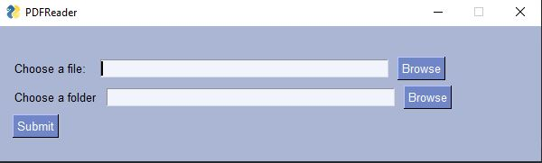

# SimplePDFReader
A simple PDF Reader to add to your projects with Python when you required to read PDF and extract information. 

## Getting Started

Download first he code using:
```
git clone git@github.com:MateoProjects/SimplePDFReader.git
```

### Prerequisites

For install Prerequisites use the following command. 

```
pip install requirements.txt
```

## Built With

* [PySimpleGUI](https://pysimplegui.readthedocs.io/en/latest/) - For desing UI
* [PDFPlumber](https://github.com/jsvine/pdfplumber) - Library used for read PDF
* [Python 3.7](https://www.python.org/downloads/release/python-370/) - Main Lenguage


## Other information

This is template code created for add to another projects more easly.
You can copy every line of code that you want. The code contains a simple UI for add more easly the file that you will 
try to extract the information.



## Authors

* **Ramon Mateo Navarro** - *Initial work* - [MateoProjects](https://github.com/MateoProjects)


